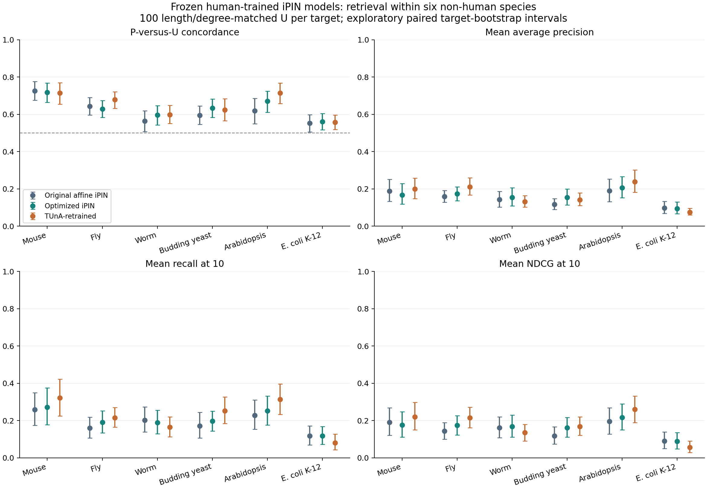

# Frozen iPIN transfer to six non-human organisms

Completed 2026-09-20. All three unchanged frozen iPIN ensembles scored **61,385 rows: 1,385 P and 60,000 U**, across 300 targets in six organisms. There are 30,497 distinct sequences and 14,492,932 residues. Every species contributes 50 targets.

**TUnA-retrained has the highest equal-species point estimate on the primary matched-U comparison (0.6478).** Its gain over optimized iPIN is +0.0134, with exploratory paired 95% interval [-0.0045, +0.0318]. The interval includes zero. The species-specific estimates and early retrieval below matter for screening; this is an external descriptive comparison, not a universal winner designation.

Transfer is uneven. Mouse and Arabidopsis have the strongest observed concordance, while E. coli K-12 is weakest. The model with the highest concordance is not always the one recovering most P at a small screening budget: affine iPIN leads mouse concordance, but TUnA-retrained leads its MAP and recall@10; optimized iPIN leads yeast concordance, but TUnA-retrained has higher recall@10.

For E. coli, TUnA-retrained mean recall@10 is 8.09%, versus 11.78% for optimized iPIN and 9.64% expected from random ordering of these candidate lists. These are point comparisons, not a tested claim of below-random performance. The [analytical random-order reference](random_ranking_reference.csv) is 10/list-size, averaged over targets; it was added during reporting and does not change any prespecified metric. E. coli is also strongly dominated by one source publication, as quantified below. Its modest PU signal is insufficient on its own to justify a general bacterial-screening recommendation.

## Primary comparison: P versus 100 matched U per target

Scores are ranked separately within each target. The table gives equal-target PU concordance; 0.5 is random ranking of the observed P/U labels. The models retain their human TRAIN normalizers, checkpoints, and inference definitions. U is unreported in the declared source snapshot, not experimentally verified noninteraction.

| Organism | Original affine iPIN | Optimized iPIN | TUnA-retrained |
|---|---:|---:|---:|
| Mouse | 0.7264 | 0.7177 | 0.7141 |
| Fly | 0.6436 | 0.6292 | 0.6783 |
| Worm | 0.5632 | 0.5956 | 0.5983 |
| Budding yeast | 0.5952 | 0.6332 | 0.6237 |
| Arabidopsis | 0.6187 | 0.6701 | 0.7151 |
| E. coli K-12 | 0.5518 | 0.5605 | 0.5574 |
| Equal-species mean | 0.6165 | 0.6344 | 0.6478 |

Intervals in the figure resample targets 10,000 times with the same draw used for all models. They are exploratory and conditional on these fixed panels. Related targets, shared partners, reversed pairs, and shared studies create dependence that these intervals do not fully capture. Intervals are pointwise, without a multiplicity correction.

### Paired primary differences: TUnA-retrained minus optimized iPIN

| Organism | Difference | Paired 95% interval |
|---|---:|---|
| Mouse | -0.0035 | [-0.0396, +0.0327] |
| Fly | +0.0491 | [+0.0123, +0.0860] |
| Worm | +0.0027 | [-0.0410, +0.0465] |
| Budding yeast | -0.0095 | [-0.0555, +0.0364] |
| Arabidopsis | +0.0450 | [-0.0065, +0.1017] |
| E. coli K-12 | -0.0031 | [-0.0494, +0.0435] |
| Equal-species mean | +0.0134 | [-0.0045, +0.0318] |

## All requested retrieval measures

[Per-target metrics](per_target_metrics.csv), [macro metrics](macro_metrics.csv), [positive ranks](positive_ranks.csv), [metric intervals](metric_intervals.csv), and [paired model differences](paired_differences.csv) contain concordance, AP/MAP, expected first-positive rank, MRR, recovered P, recall, known-positive precision, enrichment, NDCG and target success at K=5,10,20. All three candidate sets are reported: background, matched, and their union. The same P and frozen predictions are used across sets. Counts are **100+100 U per target**, not per positive.

| Matched-U equal-species metric | Original affine iPIN | Optimized iPIN | TUnA-retrained |
|---|---:|---:|---:|
| MAP | 0.1486 | 0.1582 | 0.1664 |
| MRR | 0.2442 | 0.2755 | 0.2789 |
| Recall@10 | 0.1896 | 0.2030 | 0.2245 |
| Known-positive precision@10 | 0.0880 | 0.0937 | 0.1023 |
| NDCG@10 | 0.1495 | 0.1640 | 0.1756 |

| Candidate set: equal-species PU concordance | Original affine iPIN | Optimized iPIN | TUnA-retrained |
|---|---:|---:|---:|
| background | 0.6242 | 0.6430 | 0.6529 |
| matched | 0.6165 | 0.6344 | 0.6478 |
| all_U | 0.6203 | 0.6387 | 0.6503 |

Known-positive precision is recovery of documented P in the selected list. It is not biological precision or prospective assay hit rate. Additional U changes candidate prevalence and difficulty, so AP/precision values depend on the declared candidate design. [Degree-only controls](degree_control_metrics.csv) use evaluation-source association degree and are diagnostic of ascertainment cues, not independent deployment models.

## Training exposure and sequence similarity

The audit used **4,675 actual human TRAIN pair endpoints** and 7,225 endpoints appearing in development pairs. Among the external sequences, 53 exactly match a TRAIN endpoint and 82 exactly match a development endpoint (these counts can overlap). Taxonomic difference alone is therefore insufficient to establish sequence novelty.

Exact sequence and pair flags are in [endpoint exposure](exact_endpoint_exposure.csv) and [pair exposure](exact_pair_exposure.csv). None of the selected P pairs occurs exactly in the checked human TRAIN/development pairs; two mouse U rows match previously sampled human U pairs. The `no_exact_TRAIN_DEV_endpoint` sensitivity removes a pair whenever either endpoint is an exact match to an actual TRAIN/development pair endpoint. It uses the same frozen scores and does not relabel removed P as U. Coverage is explicit in [analysis coverage](analysis_coverage.csv).

| Matched U after excluding exact TRAIN/development endpoint matches | Original affine iPIN | Optimized iPIN | TUnA-retrained |
|---|---:|---:|---:|
| Mouse | 0.7238 | 0.7132 | 0.7171 |
| Fly | 0.6436 | 0.6292 | 0.6783 |
| Worm | 0.5632 | 0.5956 | 0.5983 |
| Budding yeast | 0.5952 | 0.6332 | 0.6237 |
| Arabidopsis | 0.6187 | 0.6701 | 0.7151 |
| E. coli K-12 | 0.5518 | 0.5605 | 0.5574 |
| Equal-species mean | 0.6161 | 0.6336 | 0.6483 |

Pinned MMseqs2 searched the external sequences against actual TRAIN endpoints at sensitivity 7.5 and E<=0.001. [Sequence matches](training_sequence_similarity.csv) retain the highest-bit local match and maximum-identity match covering at least 80% of both sequences. [Target-similarity metrics](target_similarity_metrics.csv) preserve retrieval lists and group targets by similarity; [pair-homology summaries](pair_homology_summary.csv) compare P and U within the same target and 0/1/2-endpoint homology category. Those conditional subsets have different denominators and are not interchangeable with the full panel.

No qualifying hit does not rule out remote homology or a shared domain. These are human PPI-supervision exposure checks; neither absence from ESM pretraining nor complete sequence naivety is established. The frozen normalizer and encoder remain unchanged.

## Source, sampling, and coverage

The data are original XML records from archived IntAct release 252 (2026-01-09), attributed to [IntAct/IMEx](https://www.ebi.ac.uk/intact/about) and the source publications retained in `selected_evidence.json.gz`. Data are CC BY 4.0. [Sources](SOURCES.json), [revised evidence audit](SOURCE_PARSING_v2.json), and [source feasibility](source_feasibility_v2.csv) record the audit. Positives require direct-interaction annotation or a binary two-hybrid method, exactly two protein participants of the specified taxid, no negative/modelled/expansion/intramolecular flag, and no recorded non-tag features.

The initial stricter rules left little usable fly and worm coverage because they excluded all tags and all MI:0915 two-hybrid evidence. The [prescoring adjustment](PRE_SCORING_EVIDENCE_ADJUSTMENT.md) documents the methodological revision based only on source metadata. Both initial and revised counts remain public. No model predictions informed it.

Targets were selected uniformly by fixed seeded hash from those with at least two eligible positive partners. Up to ten P per target were selected the same way. U excludes every reported co-participant pair in these species archives, including complexes and negative records. All 30,000 matched U satisfy the same source-association-degree bin and the 0.5–2 length ratio; no fallback tier was used.

| Organism | P rows | Unique P pairs | Unique sequences | P-supporting studies | Largest study fraction |
|---|---:|---:|---:|---:|---:|
| Mouse | 190 | 185 | 6024 | 36 | 63.8% |
| Fly | 314 | 314 | 6663 | 11 | 56.7% |
| Worm | 219 | 219 | 4059 | 16 | 54.3% |
| Budding yeast | 227 | 225 | 4769 | 34 | 27.6% |
| Arabidopsis | 249 | 249 | 5909 | 28 | 36.5% |
| E. coli K-12 | 186 | 180 | 3075 | 11 | 83.9% |

Study fractions count unique selected P pairs supported by a publication; multiple studies can support a pair. [Full study coverage](study_coverage.csv) and [panel coverage](panel_coverage.csv) show reuse and ascertainment concentration. Eligibility and assay/study composition differ across organisms, so differences cannot be attributed solely to evolutionary distance.

The candidate universe is the archived species evidence universe, not the whole proteome. Only standard-amino-acid sequences of 50–2,000 residues are included. Yeast is specifically the S288C taxid 559292 and E. coli is K-12 taxid 83333. No sequence is truncated. Sequence and assay annotations do not authenticate every experimental construct as native full length; the task is reference-sequence partner prioritization.

## Integrity and interpretation

[Input freeze](INPUT_FREEZE.json) preceded model inference. The [independent panel audit](PANEL_VALIDATION.json) re-parsed original XML without the production parser and checked that no selected U was a reported co-participant pair. [Independent metric validation](INDEPENDENT_VALIDATION.json) checks every reported target row with sklearn ROC/AP/NDCG and separate combinatorial cutoff/rank oracles. [iPIN execution](IPIN_RUN.json) and [TUnA execution](TUNA_RUN.json) record fresh representations, exact model inputs, symmetry, native qualification and unchanged parameters/buffers.

No model was retrained, recalibrated, selected, or promoted. No original TUnA comparator was added; this study evaluates the three registered iPIN ensembles only. Human protected test pair identities and truth were not opened. The human C3 benchmark and this panel differ in sampling and evidence, so their numerical difference is not a controlled species-transfer effect. These results support choosing candidates for prospective assays within the examined scope; they do not establish binding probabilities, verified negatives, or performance on all non-human proteins.

See [reproduction and file guide](README.md) and the final checksum manifest.
