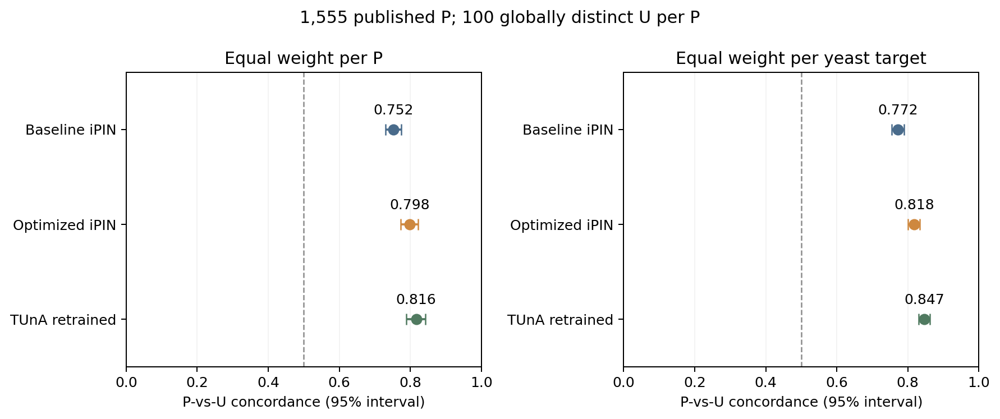

# All 1,555 P versus 155,500 globally distinct U

**Completed P-versus-unlabeled evaluation.** Every original published P is retained, with exactly 100 assigned U per P.

## Dataset

| Quantity | Count |
|---|---:|
| Published P pairs | 1,555 |
| Globally distinct U pairs | 155,500 |
| Total scored pairs | 157,055 |
| Panels (one P plus 100 U) | 1,555 |
| S288C proteins | 545 |
| Human proteins used | 19,843 |
| Eligible archived human sequence pool | 28,221 |
| Repeated U pairs | 0 |
| P/U overlap | 0 |
| Reported source pairs retained in U | 0 |

All 39 published positives that failed secondary-assay confirmation remain P. U contains pairs unreported in the declared source snapshot; it may include real interactions and is not a verified-negative label.

Matching tiers: 149,120 U meet both source-degree-bin and length criteria; 6,380 use length only. Degree-only and unmatched tiers have 0 and 0 entries. All fallbacks are retained and disclosed.

## Primary result: equal weight for every P

Concordance is the fraction of each P's 100 U scores below its P score, with half credit for ties, averaged over all 1,555 P. Chance is 0.5. The brackets are exploratory 95% target-bootstrap intervals.

| Model | P-vs-U concordance [95% interval] | Mean AP | Mean recall@10 |
|---|---:|---:|---:|
| Baseline iPIN | 0.751871 [0.729296, 0.774156] | 0.163672 | 0.369775 |
| Optimized iPIN | 0.797524 [0.772429, 0.821539] | 0.241607 | 0.488746 |
| TUnA retrained | 0.816251 [0.788643, 0.842592] | 0.288338 | 0.536334 |

Recall@10 measures recovery of the one known P in each 101-pair panel. Its random-order reference is 10/101 = 0.099010; random expected P rank is 51. These are retrieval of reported positives, not biological accuracy or precision.

## Equal-target summary

Average per-P results within each yeast target, then give all 545 targets equal weight. This reports the target weighting used in the earlier nonhuman study; the panels and U ratio still differ.

| Model | Equal-target P-vs-U concordance [95% interval] |
|---|---:|
| Baseline iPIN | 0.772082 [0.754134, 0.789386] |
| Optimized iPIN | 0.817614 [0.800430, 0.834212] |
| TUnA retrained | 0.846818 [0.830924, 0.862374] |

## Training/development exposure sensitivity

The primary result above retains all 1,555 P. This separate sensitivity removes pairs containing either exact TRAIN/development endpoint. It can change both the P count and the U count per panel.

| Model | Retained P panels | Retained U | Concordance [95% interval] |
|---|---:|---:|---:|
| Baseline iPIN | 631 | 38,898 | 0.754275 [0.725245, 0.783284] |
| Optimized iPIN | 631 | 38,898 | 0.783991 [0.751254, 0.815169] |
| TUnA retrained | 631 | 38,898 | 0.796067 [0.753747, 0.832796] |

| Organism | Proteins | Exact TRAIN | Exact development | Either |
|---|---:|---:|---:|---:|
| S288C | 545 | 0 | 0 | 0 |
| Human | 19,843 | 3,565 | 5,447 | 5,447 |

Exact pair exposure counts: {'DEV_P': 0, 'DEV_U': 0, 'TRAIN_P': 0, 'TRAIN_U': 0}. Protected human test pairs/truth were not opened. ESM pretraining exposure was not audited.

## Paired model comparisons

| Model B minus model A | Concordance difference [95% interval] |
|---|---:|
| Optimized iPIN minus Baseline iPIN | 0.045653 [0.035615, 0.056246] |
| TUnA retrained minus Baseline iPIN | 0.064379 [0.050506, 0.079547] |
| TUnA retrained minus Optimized iPIN | 0.018727 [0.005955, 0.031957] |

## Interpretation and limits

- This is the requested P-versus-unlabeled comparison. The earlier 36-versus-39 secondary-assay analysis is a different historical endpoint and is not used as P/U truth here.
- All P come from one published human–yeast study. The comparison tests ranking against this archived U sampling design; it does not establish replication across studies or human-pathogen performance.
- Human proteins/isoforms come from an archived evidence universe, with reference-sequence projection and length limits. U can contain unreported true interactions. Matching does not equalize all study or biological biases.
- The 10,000 paired bootstrap draws resample whole yeast targets. Shared human partners, homologous targets and the one source publication leave residual dependence; intervals are exploratory.
- This follow-up was designed after the previous positive scores were inspected. U selection used no model scores. Every model, normalizer and preprocessing definition was frozen; no retraining, calibration or outcome-based model selection occurred.
- Source-degree control and every per-P and per-target result are supplied so the aggregate does not hide weighting or metadata effects.

## Validation and files

Independent validation passed: 6,558 per-positive/model rows, 96 bootstrap series with 10,000 draws each, maximum metric difference 2.13e-14.
All original P, exactly 100 U per P, global uniqueness, source exclusions, sequence identities and model qualifications passed.

- [All panels](panels.csv), [positive assignments](positive_assignments.csv), and [panel validation](PANEL_VALIDATION.json)
- [All model scores](all_model_scores.csv), [per-P metrics](per_positive_metrics.csv), [per-target metrics](per_target_metrics.csv), and [summary metrics](metrics.csv)
- [Degree control](degree_control_summary.csv), [paired differences](paired_differences.csv), and [exposure summary](EXPOSURE_SUMMARY.json)
- [Protocol](PROTOCOL.md), [input freeze](INPUT_FREEZE.json), [independent result validation](RESULT_VALIDATION.json), and [reproduction](REPRODUCE.md)
- [PDF figure](pu_concordance.pdf), [SVG figure](pu_concordance.svg), and [final checksums](FINAL_MANIFEST.json)

Source attribution: EMBL-EBI IntAct/IMEx release 252 and Zhong et al. (2016), PMID 27107014, under CC BY 4.0.
