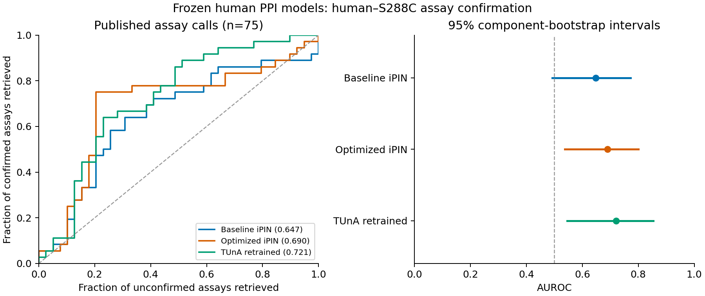

# Frozen human PPI models on published human–S288C assay confirmation

Completed reference-organism evaluation. All three registered ensembles were applied unchanged to 1,555 published pairs.

## Findings

The primary comparison contains 75 published assay outcomes: 36 confirmed and 39 unconfirmed.
The endpoint is the authors' orthogonal-assay confirmation call. Unconfirmed pairs are not established biological noninteractions.

| Frozen model | AUROC [95% interval] | Average precision [95% interval] | Spearman with assay score |
|---|---:|---:|---:|
| Baseline iPIN | 0.647 [0.493, 0.772] | 0.622 [0.425, 0.813] | 0.277 |
| Optimized iPIN | 0.690 [0.537, 0.800] | 0.655 [0.473, 0.812] | 0.353 |
| TUnA retrained | 0.721 [0.546, 0.853] | 0.653 [0.449, 0.842] | 0.434 |

The AUROC chance reference is 0.5. The AP prevalence reference is 0.480.

The exploratory AUROC interval is above 0.5 for Optimized iPIN, TUnA retrained. This supports signal for this fixed assay-confirmation endpoint within this study.

These results do not establish performance on human pathogens, discovery of new interactions, or performance against verified biological noninteractions.

## Exposure sensitivity

Excluding pairs with either exact TRAIN or development endpoint leaves 34 assay pairs (16 confirmed, 18 unconfirmed).

| Frozen model | AUROC [95% interval] | Average precision [95% interval] |
|---|---:|---:|
| Baseline iPIN | 0.663 [0.462, 0.827] | 0.647 [0.409, 0.860] |
| Optimized iPIN | 0.649 [0.399, 0.812] | 0.619 [0.367, 0.857] |
| TUnA retrained | 0.806 [0.577, 0.931] | 0.757 [0.495, 0.941] |

The exposure-filtered AUROC interval remains above 0.5 for TUnA retrained. This sensitivity is smaller and has wider uncertainty.

Exact endpoint exposure across the complete published dataset:

| Organism | Proteins | Seen in TRAIN | Seen in development | TRAIN homolog ≥30% identity, ≥80% coverage of both |
|---|---:|---:|---:|---:|
| S288C | 545 | 0 | 0 | 59 |
| Human | 466 | 206 | 266 | 277 |

TRAIN and development endpoint counts may overlap. Exact pair overlap counts: DEV_P=0, DEV_U=0, TRAIN_P=0, TRAIN_U=0.
The audit used actual human TRAIN/development files and pinned MMseqs2. Protected test-pair identities and truth were not opened. Protein-language-model pretraining exposure was not audited.

## Paired model comparisons

Primary-cohort differences; model A minus model B:

| Model A | Model B | AUROC difference [95% interval] |
|---|---|---:|
| Optimized iPIN | Baseline iPIN | 0.043 [-0.037, 0.106] |
| TUnA retrained | Baseline iPIN | 0.073 [-0.041, 0.184] |
| TUnA retrained | Optimized iPIN | 0.031 [-0.066, 0.135] |

Every primary paired AUROC interval includes zero. The observed model ordering does not establish a clear difference between models on this cohort.

## Source, mapping and limitations

The source is the published human–yeast study by Zhong et al. (2016), [PMID 27107014](https://pubmed.ncbi.nlm.nih.gov/27107014/), and archived IntAct release 252.
Table EV7 has 91 calls (47 yes, 44 no). The same source-identity rule retained 75 rows and excluded 16 rows (11 yes, 5 no) that did not map to exactly one verified eligible sequence pair through Table EV2's identifiers.
See [comparison_mapping_audit.csv](comparison_mapping_audit.csv) for every decision. Unequal attrition by outcome limits representativeness; no sequence or isoform was selected using model scores.
All retained assay pairs are within the previously reported positive network. The comparison asks whether model scores track confirmation in a different assay; it does not estimate retrieval among arbitrary human partners. The other published-pair scores are descriptive outputs.
Reference-sequence taxonomy is supported by archived records; every historical construct or culture was not independently authenticated. K-12 was reviewed but omitted from the primary cohort because only four published pairs were available.

## Uncertainty and validation

- `all_mapped_assays`: 38 connected components, largest component 12 pairs, 10000 valid draws from 10,000.
- `no_exact_train_or_development_endpoint`: 18 connected components, largest component 7 pairs, 10000 valid draws from 10,000.

Intervals resample connected components of the shared-endpoint graph, with identical draws across models and seed 20260921. They are exploratory and conditional on one publication and assay context; they do not demonstrate replication across studies. Spearman values are descriptive.
All 4,216 selected source evidence records were checked against original XML. The independent result audit used a separate worksheet reader, explicit repeated-observation bootstraps, sklearn metrics, and independently reconstructed graph components.
Independent validation passed; maximum checked metric/interval error was 1.11e-16 (tolerance 1e-12). Both iPIN models passed pair-order checks. TUnA passed native-path agreement, pair-order symmetry, and parameter/buffer preservation for all three ensemble members.

## Artifacts and reproduction

[Input freeze](INPUT_FREEZE.json) · [Evaluation protocol](EVALUATION_PROTOCOL.md) · [Independent validation](RESULT_VALIDATION.json) · [Final checksums](FINAL_MANIFEST.json)

- [All published-pair scores](all_model_scores.csv)
- [Assay outcomes, exposure flags and model scores](assay_model_scores.csv)
- [Metrics](metrics.csv) and [paired differences](paired_differences.csv)
- [PDF figure](assay_confirmation.pdf) and [SVG figure](assay_confirmation.svg)
- [Reproduction commands](REPRODUCE.md)

Data attribution: EMBL-EBI IntAct / IMEx and original authors, [CC BY 4.0](https://www.ebi.ac.uk/intact/about). No model was retrained, recalibrated or selected using these outcomes.
