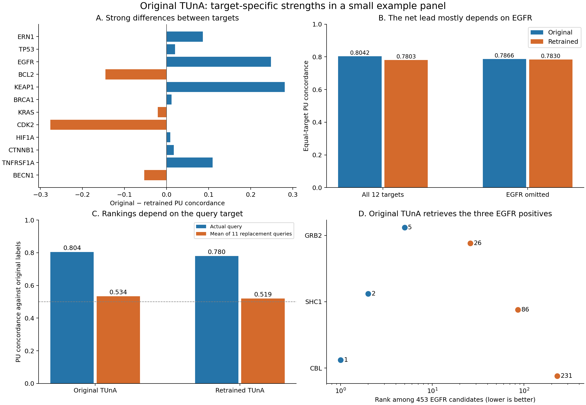

# Why original TUnA performs well in the twelve-target example

Original TUnA's scores are reproducible. Its net advantage over retrained TUnA
is dominated by EGFR, for which its documented training data contain positive
interactions between close sequence relatives of **all three** nominated pairs.
Those analogous pairs are absent from the frozen retraining TRAIN/development
tables. Transfer from related proteins is therefore a concrete, plausible
explanation; this audit does not establish which individual training examples
caused the predictions.

The example is a small, deliberately selected retrieval exercise: 12 targets,
37 nominated positives, and 5,550 unlabeled pairs. It does not establish general
superiority. The completed main benchmark favors retrained TUnA on C3.

## 1. The main difference is EGFR

These results use P + all 150 U per positive and equal target weighting.

| Evaluation | Original PU concordance | Retrained PU concordance | Original MAP | Retrained MAP | P recovered in top 10, original / retrained |
|---|---:|---:|---:|---:|---:|
| All 12 targets | 0.804221 | 0.780305 | 0.183589 | 0.106105 | 10 / 7 |
| EGFR omitted: 11 targets | 0.786557 | 0.783026 | 0.121491 | 0.113487 | 7 / 7 |
| Remove exact prior pairs from any model: 11 evaluable targets | 0.765922 | 0.741184 | 0.160378 | 0.067526 | 7 / 5 |
| Remove exact prior pairs and omit EGFR: 10 evaluable targets | 0.742662 | 0.740265 | 0.089749 | 0.071789 | 4 / 5 |

EGFR contributes **86.5% of the net macro PU gap** and **90.5% of the net MAP gap**.
These are arithmetic contributions, not causal percentages. Other gains and
losses cancel: original wins strongly on KEAP1 (+0.2807 PU), while retrained
wins strongly on CDK2 (original minus retrained = −0.2763). Original wins on
8/12 targets for PU concordance, but AP splits 6/12 versus 6/12.

The paired target bootstrap gives an exploratory 95% percentile interval of
**[−0.0598, +0.1062]** for the PU difference, and **[−0.0393, +0.2395]** for the
MAP difference. Both include zero. These twelve selected targets, with shared
partners, do not support a population-level confidence guarantee.

Exact-exposure filtering removes P and U exposed in documented original
TRAIN/validation or iPIN TRAIN/development. BCL2 then has no remaining P and
cannot be evaluated; it is omitted explicitly, not assigned zero. The first
filtered row contains 30 P and 5,080 U; also omitting EGFR leaves 27 P and 4,630 U.
See [exposure sensitivities](exposure_sensitivity.csv),
[all target contributions](target_contributions.csv),
[leave-one-target-out results](leave_one_target_out.csv), and
[bootstrap results](paired_target_bootstrap.csv).

## 2. A specific training-data explanation for EGFR

| EGFR positive | Original rank / 453 | Retrained rank / 453 | Positive pair in original TRAIN between best local sequence matches |
|---|---:|---:|---|
| EGFR–GRB2 | 5 | 26 | ERBB3–GRAP2 |
| EGFR–SHC1 | 2 | 86 | ERBB3–SHC4 |
| EGFR–CBL | 1 | 231 | ERBB3–CBLB |

Neither EGFR nor GRB2, SHC1, or CBL appears by accession or exact sequence in the
documented original TRAIN/validation lists. However, a fixed MMseqs2 search
identified these TRAIN sequence relatives, choosing matches by alignment bits,
without looking at PPI labels:

| Example protein | Best local TRAIN sequence match | Alignment identity | Query coverage | Reference coverage |
|---|---|---:|---:|---:|
| EGFR | [ERBB3 / P21860](https://www.uniprot.org/uniprotkb/P21860/entry) | 47.4% | 83.0% | 74.8% |
| GRB2 | [GRAP2 / O75791](https://www.uniprot.org/uniprotkb/O75791/entry) | 33.9% | 99.1% | 100.0% |
| SHC1 | [SHC4 / Q6S5L8](https://www.uniprot.org/uniprotkb/Q6S5L8/entry) | 46.9% | 98.3% | 93.8% |
| CBL | [CBLB / Q13191](https://www.uniprot.org/uniprotkb/Q13191/entry) | 50.6% | 96.2% | 96.4% |

All three resulting analogous pairs have **label 1 in original Intra1 TRAIN**.
None appears in frozen iPIN TRAIN P, TRAIN U, development P, or development U,
checked by accession or exact sequence. EGFR, ERBB3, SHC1, and SHC4 occur in no
actual retraining TRAIN pair rows under their accessions, despite appearing in
the broader sequence catalogue. GRB2, GRAP2, and CBLB do have other retraining
TRAIN pairs. CBL's accession is absent from that catalogue. Catalogue membership
alone is therefore not evidence of downstream PPI training exposure.

The EGFR–ERBB3 alignment misses the stricter **80% coverage on both sequences**
criterion because reference coverage is 74.8%. Consequently, the strictly
thresholded relative-pair audit reports no EGFR matches. That threshold result
does **not** erase the substantial local similarity shown above. This is why
both local and extensive-coverage matches are reported. Alignment identity and
coverage are MMseqs2's reported fractions, rounded to its output precision.

The mechanism is plausible: the original model could transfer a learned
receptor/adaptor-family pattern to EGFR's partners. Establishing causality would
require controlled retraining or training-example influence experiments, which
were not performed. The documented lists also cannot authenticate the entire
history of the authors' checkpoint.

Sources: [sequence alignments](sequence_relative_matches.csv),
[strict relative-pair exposure](sequence_relative_pair_exposure.csv),
[nominated and best-local-relative pair exposure](nominated_and_relative_pair_exposure.csv),
[retraining endpoint context](ipin_training_endpoint_context.csv), and
[UniProt name snapshot](relative_protein_names.tsv). The homology search and
relative-pair audit are explicitly post hoc follow-ups; see
[their protocol](HOMOLOGY_FOLLOWUP.md).

## 3. The model responds to the query target

For each panel, replace the query with each of the other eleven targets, retain
the original partner list, and score again. The reference P/U labels still refer
to the **original** target. No biological labels are assigned to the replacement
pairs; this measures persistence of a partner ranking under query replacement.

| Model / panel | Actual-query PU | Mean replacement-query PU | Actual AP or MAP | Mean replacement AP or MAP |
|---|---:|---:|---:|---:|
| Original, all targets | 0.804221 | 0.534064 | 0.183589 | 0.023036 |
| Retrained, all targets | 0.780305 | 0.519441 | 0.106105 | 0.016921 |
| Original, EGFR | 0.998519 | 0.513805 | 0.866667 | 0.055839 |
| Retrained, EGFR | 0.750370 | 0.682290 | 0.024901 | 0.029463 |

Thus original TUnA's EGFR result cannot be explained simply by always ranking
GRB2, SHC1, and CBL highly regardless of query. It is compatible with
target-dependent transfer from related protein families. It is not proof of
learning binding interfaces or experimentally correct replacement-pair labels.

All five candidate sets and every replacement are included in
[query-swap metrics](query_swap_metrics.csv) and
[query-swap summaries](query_swap_summary.csv). A partner-only control averaging
rank percentiles over all eleven replacement queries reaches macro PU 0.5778
for original and 0.5495 for retrained, far below the actual-query values.

## 4. Candidate selection makes the absolute scores look stronger

| U candidate set | Original PU concordance | Retrained PU concordance |
|---|---:|---:|
| Context matched | 0.728681 | 0.722072 |
| Background | 0.806528 | 0.771030 |
| Low plausibility | 0.877454 | 0.847812 |
| Context + background | 0.767604 | 0.746551 |
| All U | 0.804221 | 0.780305 |

Both models separate nominated P from low-plausibility U more easily than from
context-matched U. The original-versus-retrained gap on context U is only 0.0066.
With equal stratum sizes, all-U PU is the mean of the three stratum PU values.
Adding the easier low-plausibility set increases PU while lowering MAP because
there are more candidates. None of these U are confirmed negatives.

There is also an endpoint-exposure imbalance: original TRAIN contains 15/37
positive partner instances, compared with 537/1,850 context U, 406/1,850
background U, and 342/1,850 low-plausibility U instances. A simple partner TRAIN
positive-degree ranking reaches macro PU **0.6098** and MAP **0.0653** on all U.
This shows that endpoint-level information helps on this panel, but it falls
well short of original TUnA and does not explain EGFR, whose four proteins are
unseen in those lists. The degree-fraction control reaches PU 0.4670. These
controls do not establish what features the neural model internally uses.
See [all control metrics](diagnostic_macro_metrics.csv),
[endpoint exposure](endpoint_exposure_summary.csv), and
[within-U score/degree associations](score_degree_correlations.csv).

## 5. Scoring and numerical explanations checked

- Replaying all 5,587 saved pairs for original and the three retrained members
  using the parent endpoint arrays reproduces every score **exactly**.
- Direct unaccelerated native batch-one inference from the authors' checkpoint
  agrees within **1.79 × 10⁻⁷** on 50 fixtures: all 37 P, each target's highest
  original-scoring U, and the longest pair. All state tensors of the authors'
  checkpoint and frozen original runtime checkpoint are identical; their file
  hashes differ because their serialized files differ. Native covariance
  recomputation also matches the frozen covariance exactly.
- Original's raw logits give macro PU **0.803657**. GP uncertainty adjustment
  changes this to **0.804221**, only +0.000563. Adjusted logits and sigmoid
  probabilities have the same retrieval metrics; no score saturates to 0 or 1.
  Probability-versus-logit scale does not explain the ranking advantage.
- Frozen checkpoints, registry, parent panels, scores, and reports remain
  unchanged. Parent feature arrays are deliberately reused for diagnostics;
  this is not described as another fresh embedding run.

The pinned implementation's block-diagonal masks and first-column pooling allow
equivalent independent endpoint features followed by coordinate-wise maximum
and the GP head. Both TUnA versions use that same implementation. Native
agreement validates the adapter; the architecture alone does not account for
their different fitted predictions. See the
[native checkpoint checks](GPU_DIAGNOSTICS.json),
[50 fixture predictions](authors_checkpoint_native_predictions.csv), and
[score-component metrics](score_component_metrics.csv).

## 6. Different training tasks, different evaluation populations

Original's documented TRAIN has **64,811 positive and 64,781 sampled-negative
rows**. The authors describe their Bernett dataset and binary prediction task
in the [TUnA paper](https://academic.oup.com/bib/article/25/5/bbae359/7720609).
Retrained TUnA starts its PPI model from random initialization, not from the
original checkpoint. It uses **16,799 P and 2,000,000 U**, a design-weighted
pairwise ranking loss, adapted TRAIN-only GP covariance, and a three-seed mean
selected on development C3. See the frozen
[training specification](../../benchmark/tuna/provenance/TRAINING_FREEZE.json)
and [original source counts](original_public_source_counts.csv).

The completed repository benchmark reports:

| Model | C1 | C2 | C3 |
|---|---:|---:|---:|
| Original TUnA | 0.716166 | 0.698193 | 0.695658 |
| Retrained TUnA | 0.948619 | 0.880401 | 0.815875 |
| iPIN baseline | 0.843493 | 0.805299 | 0.789249 |
| iPIN optimized | 0.916037 | 0.851301 | 0.807948 |

These are the already published [aggregate benchmark results](../../benchmark/tuna/results/RESULTS.md).
Its design-weighted C1/C2/C3 estimands differ from equal-target averages on the
curated examples. No protected test pairs, truth, or per-pair predictions were
opened for this investigation. The ranking reversal is evidence that model
preference depends on the evaluation population, not evidence of a scoring bug.

The best-supported interpretation is a real, reproducible **query-dependent
strength on this example**, with a plausible family-transfer route from richer
relevant original training data, and an aggregate lead that is sensitive to
EGFR and the U design. Exact-pair removal alone is insufficient to make the
comparison free of related-protein exposure. Controlled comparisons using new
targets and relatives excluded from every model's downstream training would be
needed to assess broader generalization fairly.
