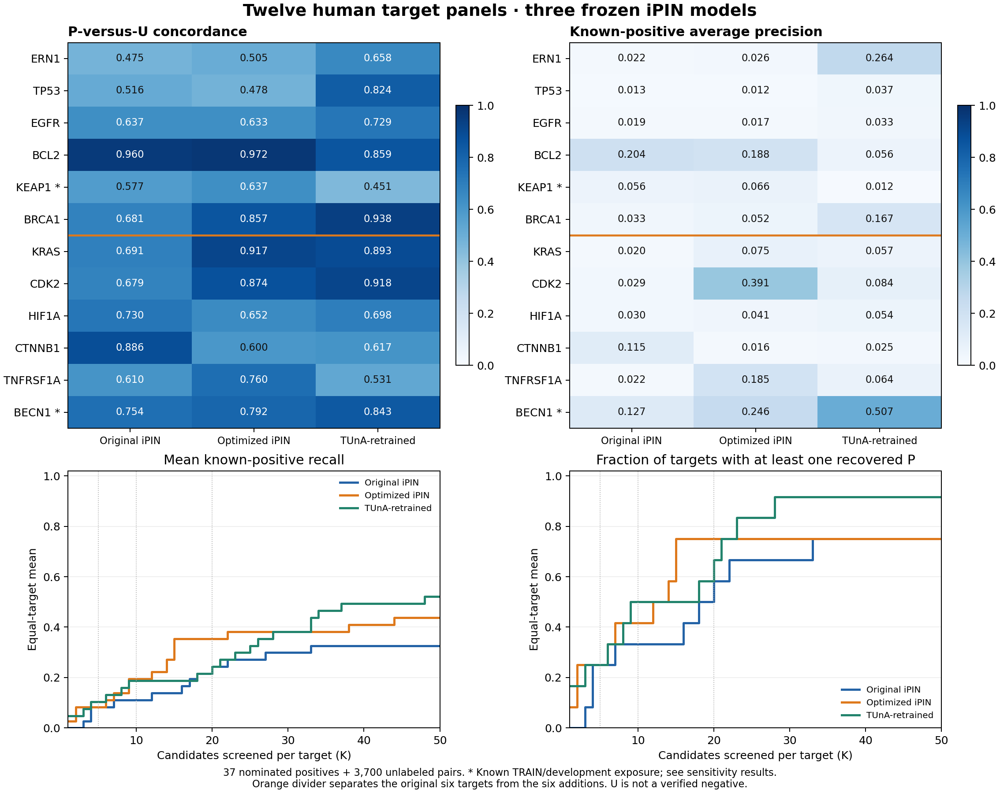

# Twelve-target comparison of the three frozen iPIN models

The example application now contains **12 human targets, 37 nominated positives,
and 3,700 unlabeled pairs**. All 3,737 pairs were scored by original iPIN,
optimized pooled iPIN, and TUnA-retrained, using the unchanged
[three-model catalogue](../../docs/models/FROZEN_PAIR_MODELS_v2.md).
These are descriptive biological retrieval cases; no model was selected or tuned.

The additional targets are KRAS, CDK2, HIF1A, CTNNB1, TNFRSF1A, and BECN1.
Their evidence, canonical identities, selection rules, source checksums, and
exposure records are retained in each target folder. All original six inputs and
their [historical four-predictor comparison](../six_target_comparison_v1/REPORT.md)
are preserved. Original released TUnA is a historical comparator, not one of the
three frozen iPIN models scored in this extension.

## Equal-target results

Higher is better for the metrics below. Every target has equal weight. MAP is
mean average precision; MRR concerns the first known partner; recall concerns
the nominated positives. All cutoff metrics are available at K=5,10,20, including
known-positive precision and successful-target counts. Definitions and tie rules
are in [METRICS.md](METRICS.md); complete results are in [macro_metrics.csv](macro_metrics.csv).

| Model | PU concordance | MAP | MRR | Recall@5 | Recall@10 | Recall@20 | NDCG@10 | NDCG@20 | EF@20 | Targets with P@20 |
| --- | --- | --- | --- | --- | --- | --- | --- | --- | --- | --- |
| Original iPIN | 0.683 | 0.058 | 0.105 | 0.083 | 0.111 | 0.243 | 0.066 | 0.112 | 3.788 | 7/12 |
| Optimized iPIN | 0.723 | 0.110 | 0.219 | 0.083 | 0.194 | 0.354 | 0.139 | 0.197 | 5.471 | 9/12 |
| TUnA-retrained | 0.747 | 0.113 | 0.248 | 0.104 | 0.188 | 0.243 | 0.146 | 0.164 | 3.788 | 8/12 |

TUnA-retrained has the highest mean PU concordance and MAP in the main panel.
Optimized iPIN recovers the most nominated positives within the top 20:
**13/37**, compared with **9/37** for original iPIN and **9/37** for TUnA-retrained.
Model ordering therefore depends on the retrieval objective. The exposure
sensitivities below are part of the interpretation of these main-panel values.

Standalone exports: [PDF](retrieval_summary.pdf) and [SVG](retrieval_summary.svg).

## Individual targets: P-versus-U concordance

| Target | P / U | Original iPIN | Optimized iPIN | TUnA-retrained |
| --- | --- | --- | --- | --- |
| [ERN1](../ERN1/RESULTS_v2.md) | 4 / 400 | 0.475 | 0.505 | 0.658 |
| [TP53](../TP53/RESULTS_v2.md) | 3 / 300 | 0.516 | 0.478 | 0.824 |
| [EGFR](../EGFR/RESULTS_v2.md) | 3 / 300 | 0.637 | 0.633 | 0.729 |
| [BCL2](../BCL2/RESULTS_v2.md) | 3 / 300 | 0.960 | 0.972 | 0.859 |
| [KEAP1](../KEAP1/RESULTS_v2.md) | 3 / 300 | 0.577 | 0.637 | 0.451 |
| [BRCA1](../BRCA1/RESULTS_v2.md) | 3 / 300 | 0.681 | 0.857 | 0.938 |
| [KRAS](../KRAS/RESULTS_v2.md) | 3 / 300 | 0.691 | 0.917 | 0.893 |
| [CDK2](../CDK2/RESULTS_v2.md) | 3 / 300 | 0.679 | 0.874 | 0.918 |
| [HIF1A](../HIF1A/RESULTS_v2.md) | 3 / 300 | 0.730 | 0.652 | 0.698 |
| [CTNNB1](../CTNNB1/RESULTS_v2.md) | 3 / 300 | 0.886 | 0.600 | 0.617 |
| [TNFRSF1A](../TNFRSF1A/RESULTS_v2.md) | 3 / 300 | 0.610 | 0.760 | 0.531 |
| [BECN1](../BECN1/RESULTS_v2.md) | 3 / 300 | 0.754 | 0.792 | 0.843 |

Each linked target report also gives AP, first-positive rank, reciprocal rank,
recovered counts, recall, NDCG, enrichment, and target success. Full stratum and
sensitivity metrics are in [per_target_metrics.csv](per_target_metrics.csv).
[Positive ranks](positive_partner_ranks.csv), [matched positive-control metrics](matched_positive_metrics.csv),
and [screening-budget curves](retrieval_curves.csv) retain the underlying detail.

## Exposure and sensitivity

The exact-pair audit identified **BECN1-ATG14 and BECN1-UVRAG in TRAIN-P**, and
the existing **KEAP1-SQSTM1 pair in DEV-P**. All U candidates are absent from the
checked TRAIN/development P and U arrays by accession and exact sequence.
Exposure results were recorded before scoring; nominated partners were not
replaced using model performance. The main result also retains the original
ERN1 homodimer. Sensitivity removes exposed positives, and then the homodimer,
from the ranked candidate lists while retaining the same U controls.

| Positive subset | Model | P | PU concordance | MAP | Recall@20 |
| --- | --- | --- | --- | --- | --- |
| all_P | Original iPIN | 37 | 0.683 | 0.058 | 0.243 |
| all_P | Optimized iPIN | 37 | 0.723 | 0.110 | 0.354 |
| all_P | TUnA-retrained | 37 | 0.747 | 0.113 | 0.243 |
| exclude_prior_train_development_P | Original iPIN | 34 | 0.630 | 0.043 | 0.160 |
| exclude_prior_train_development_P | Optimized iPIN | 34 | 0.676 | 0.085 | 0.271 |
| exclude_prior_train_development_P | TUnA-retrained | 34 | 0.711 | 0.071 | 0.188 |
| exclude_prior_train_development_P_and_homomers | Original iPIN | 33 | 0.617 | 0.042 | 0.139 |
| exclude_prior_train_development_P_and_homomers | Optimized iPIN | 33 | 0.663 | 0.083 | 0.250 |
| exclude_prior_train_development_P_and_homomers | TUnA-retrained | 33 | 0.702 | 0.050 | 0.167 |

The original and additional cohorts are also shown separately:

| Cohort | Model | PU concordance | MAP | Recall@20 |
| --- | --- | --- | --- | --- |
| original_six | Original iPIN | 0.641 | 0.058 | 0.264 |
| original_six | Optimized iPIN | 0.680 | 0.060 | 0.319 |
| original_six | TUnA-retrained | 0.743 | 0.095 | 0.208 |
| additional_six | Original iPIN | 0.725 | 0.057 | 0.222 |
| additional_six | Optimized iPIN | 0.766 | 0.159 | 0.389 |
| additional_six | TUnA-retrained | 0.750 | 0.132 | 0.278 |

Only 3-4 positives are nominated per target. These are not exhaustive interaction
catalogues or a random sample of human biology. The three RAF partners are
homologous; targets also share some proteins. Metrics do not establish statistical
superiority, homology-independent generalization, or absence from sequence
pretraining. Existing IRE1 cases and the original six panels have been examined
before. Binding conditions, phosphorylation, hydroxylation, nucleotide state,
proteolysis, and experimental fragments are not encoded by a canonical sequence.

U is unknown, not an experimentally verified noninteractor. AP, NDCG, and
known-positive precision describe this reference panel rather than true
interaction precision. EF rescales recall; ordinary P/U ROC-AUC equals the
reported concordance. No accuracy, F1, MCC, calibration, or common score-threshold
claim is made. Context and background U groups are reported separately, and
historical benchmark sampling weights are not reused.

## Execution and validation

All **3,344 unique human sequences** were fetched from
UniProt and matched to panel hashes. Both frozen preprocessing pipelines were
recomputed from scratch across all twelve targets. No existing embedding or
endpoint feature cache was used. The frozen TRAIN normalization, model weights,
GP covariance, selected epoch 4, seed order, and equal FP64 ensemble means were
preserved. No training, checkpoint reselection, GP refitting, or protected-test
access took place.

The [independent validation](INDEPENDENT_VALIDATION.json) checks all 11,211
ensemble scores, 540 target/subset/stratum metric rows, 333 matched-positive metric
rows, 135 macro rows, 1,800 curve rows, and 111 positive-rank rows. AP, NDCG, and
P/U AUROC were independently recomputed with scikit-learn; exposure and matching
constraints were rechecked. [Unit-test evidence](UNIT_TESTS.xml) and
[metric tie tests](METRIC_TESTS.xml) are retained.

The [original-six consistency check](ORIGINAL_SIX_CONSISTENCY.json) found a
maximum fresh-score difference of 1.13e-05 and 0 changed rank
entries across the three models. Fresh FP32 batch composition can affect rounding;
the original results are retained exactly.

Reproduction instructions and the artifact map are in [README.md](README.md).
