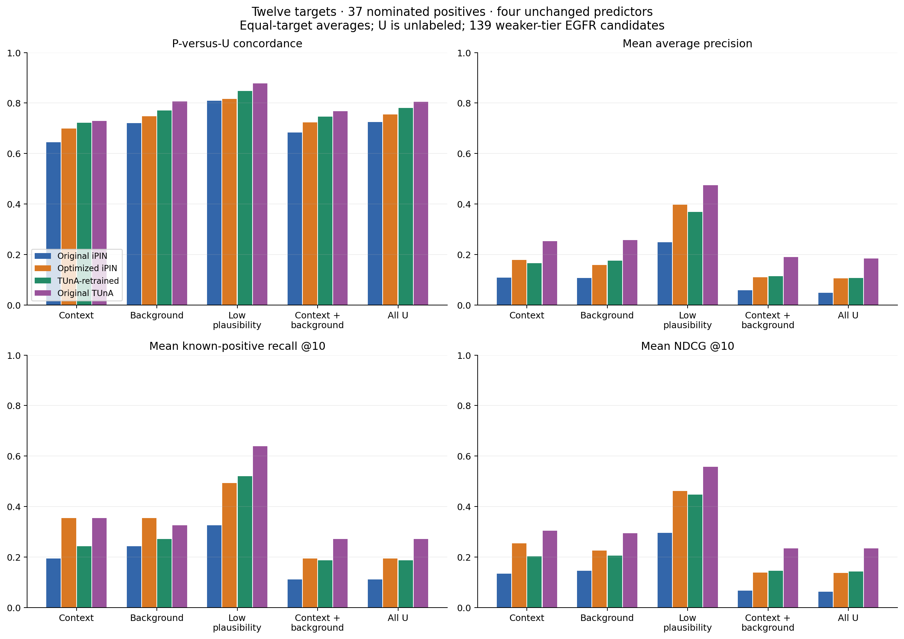
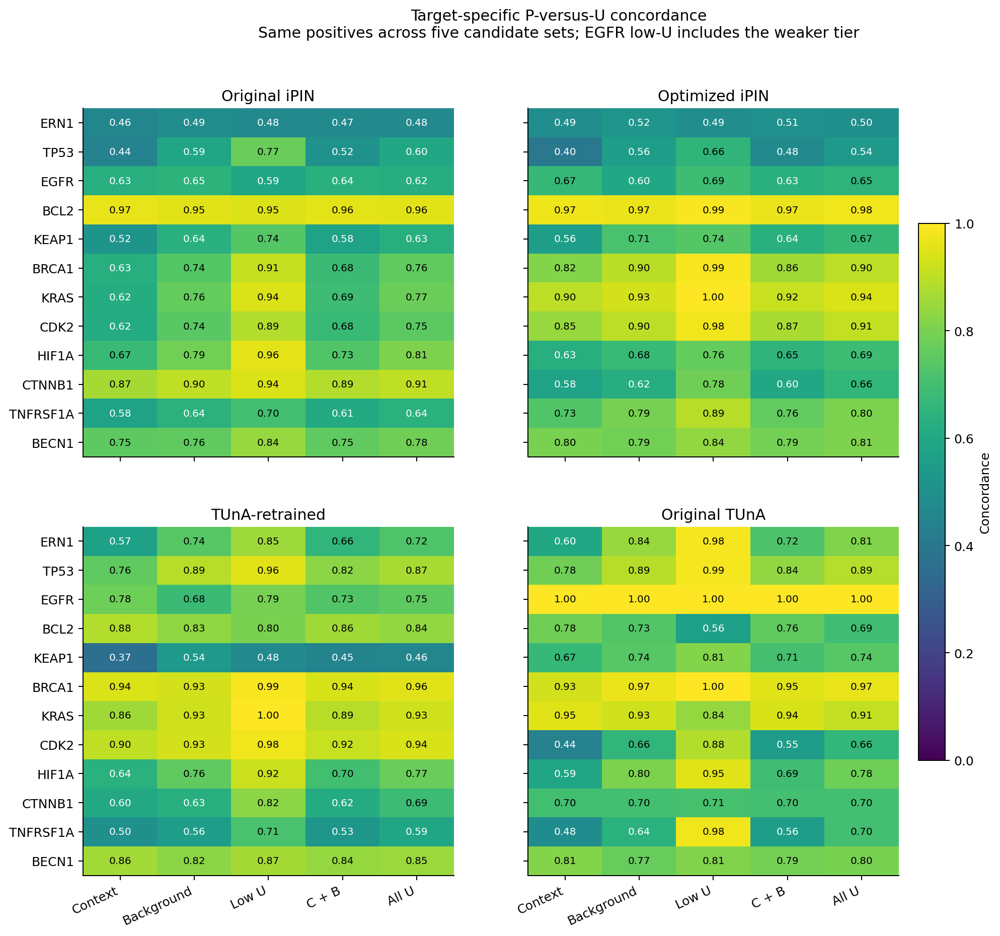
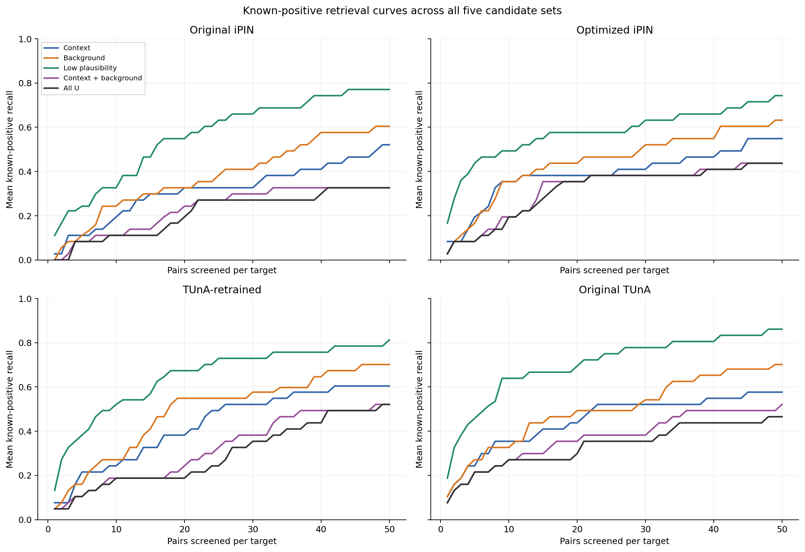

# Twelve targets, three U strata and four frozen predictors

Completed descriptive application: **37 P + 5,550 U = 5,587 pairs**, scored by the three frozen iPIN models and original published TUnA. Each positive has 50 context, 50 background and 50 low-plausibility U. Original TUnA remains a comparator; the iPIN registry still contains three models.

Across the twelve targets, all 3,737 original rows are preserved as prefixes of the extended panels. Selection used biological annotations and exclusion records before new scores. Every sequence was freshly retrieved and both embedding pipelines recomputed for 4,012 unique sequences. [Input freeze](INPUT_FREEZE.json), [selection protocol](SELECTION.md), [metric protocol](METRICS.md), and [independent validation](INDEPENDENT_VALIDATION.json) provide the audit trail.

## Evidence and interpretation

Of 1,850 additions, **1,711 are tier A** (annotated compartment separation) and **139 are tier B**, all for EGFR. Tier B is a weaker dominant-location prior with known nuclear/mitochondrial overlap, not spatial incompatibility. The user approved keeping 50 using explicit tiers. Neither tier is a verified negative.

The additions use 803 unique candidate sequences; 314 recur across targets. Annotation quality counts: dual UniProt-experimental/HPA support 897; UniProt experimental only 856; HPA-supported plus reviewed UniProt 14; reviewed-only fallback 83. Every row has provenance in [low_plausibility_annotations.csv](low_plausibility_annotations.csv), with target-level counts in [selection_summary.csv](selection_summary.csv).

## All five candidate sets

Equal-target averages over all twelve targets and all 37 P. PU = P-versus-U concordance. MAP and MRR average target-level AP and reciprocal rank. Larger is better except first-positive rank. Original TUnA's sigmoid scores retain saturation ties.

| Candidate set | Model | PU | MAP | MRR | Mean first P rank |
| --- | --- | --- | --- | --- | --- |
| Context | Original iPIN | 0.6452 | 0.1081 | 0.2062 | 17.2500 |
| Context | Optimized iPIN | 0.6986 | 0.1776 | 0.3435 | 15.7500 |
| Context | TUnA-retrained | 0.7221 | 0.1657 | 0.3502 | 11.7500 |
| Context | Original TUnA | 0.7287 | 0.2528 | 0.4226 | 13.2500 |
| Background | Original iPIN | 0.7206 | 0.1072 | 0.1844 | 12.4167 |
| Background | Optimized iPIN | 0.7476 | 0.1583 | 0.2665 | 15.0833 |
| Background | TUnA-retrained | 0.7710 | 0.1749 | 0.3082 | 8.6667 |
| Background | Original TUnA | 0.8065 | 0.2565 | 0.4429 | 10.2500 |
| Low plausibility | Original iPIN | 0.8095 | 0.2481 | 0.4915 | 7.0000 |
| Low plausibility | Optimized iPIN | 0.8170 | 0.3972 | 0.6103 | 8.8333 |
| Low plausibility | TUnA-retrained | 0.8478 | 0.3688 | 0.5917 | 6.0833 |
| Low plausibility | Original TUnA | 0.8775 | 0.4748 | 0.6665 | 3.6667 |
| Context + background | Original iPIN | 0.6829 | 0.0576 | 0.1051 | 28.6667 |
| Context + background | Optimized iPIN | 0.7231 | 0.1097 | 0.2192 | 29.8333 |
| Context + background | TUnA-retrained | 0.7466 | 0.1132 | 0.2483 | 19.4167 |
| Context + background | Original TUnA | 0.7676 | 0.1903 | 0.3503 | 22.5000 |
| All U | Original iPIN | 0.7251 | 0.0481 | 0.0933 | 34.6667 |
| All U | Optimized iPIN | 0.7544 | 0.1047 | 0.2154 | 37.6667 |
| All U | TUnA-retrained | 0.7803 | 0.1061 | 0.2373 | 24.5000 |
| All U | Original TUnA | 0.8042 | 0.1836 | 0.3456 | 25.1667 |

### Fixed screening budgets

Recovered P is summed across targets, out of 37. Recall, known-positive precision, EF and NDCG are equal-target means. Success is expected successful targets out of 12, with exact fractional tie credit.

#### K = 5

| Set | Model | Recovered P /37 | Recall | Known-P precision | EF | NDCG | Success /12 |
| --- | --- | --- | --- | --- | --- | --- | --- |
| Context | Original iPIN | 4.0000 | 0.1111 | 0.0667 | 3.4000 | 0.0978 | 4.0000 |
| Context | Optimized iPIN | 7.0000 | 0.1944 | 0.1167 | 5.9500 | 0.1813 | 5.0000 |
| Context | TUnA-retrained | 8.0000 | 0.2153 | 0.1333 | 6.8000 | 0.1915 | 7.0000 |
| Context | Original TUnA | 9.0000 | 0.2431 | 0.1500 | 7.6500 | 0.2524 | 6.0000 |
| Background | Original iPIN | 4.0000 | 0.1111 | 0.0667 | 3.4000 | 0.0840 | 4.0000 |
| Background | Optimized iPIN | 6.0000 | 0.1667 | 0.1000 | 5.1000 | 0.1400 | 6.0000 |
| Background | TUnA-retrained | 6.0000 | 0.1597 | 0.1000 | 5.1000 | 0.1523 | 5.0000 |
| Background | Original TUnA | 10.0000 | 0.2708 | 0.1667 | 8.5000 | 0.2676 | 6.0000 |
| Low plausibility | Original iPIN | 9.0000 | 0.2431 | 0.1500 | 7.6500 | 0.2575 | 8.0000 |
| Low plausibility | Optimized iPIN | 16.0000 | 0.4375 | 0.2667 | 13.6000 | 0.4365 | 9.0000 |
| Low plausibility | TUnA-retrained | 14.0000 | 0.3819 | 0.2333 | 11.9000 | 0.3834 | 9.0000 |
| Low plausibility | Original TUnA | 17.0000 | 0.4583 | 0.2833 | 14.4500 | 0.4756 | 8.0000 |
| Context + background | Original iPIN | 3.0000 | 0.0833 | 0.0500 | 5.0500 | 0.0532 | 3.0000 |
| Context + background | Optimized iPIN | 3.0000 | 0.0833 | 0.0500 | 5.0500 | 0.0885 | 3.0000 |
| Context + background | TUnA-retrained | 4.0000 | 0.1042 | 0.0667 | 6.7333 | 0.1080 | 3.0000 |
| Context + background | Original TUnA | 8.0000 | 0.2153 | 0.1333 | 13.4667 | 0.2099 | 5.0000 |
| All U | Original iPIN | 3.0000 | 0.0833 | 0.0500 | 7.5500 | 0.0505 | 3.0000 |
| All U | Optimized iPIN | 3.0000 | 0.0833 | 0.0500 | 7.5500 | 0.0885 | 3.0000 |
| All U | TUnA-retrained | 4.0000 | 0.1042 | 0.0667 | 10.0667 | 0.1053 | 3.0000 |
| All U | Original TUnA | 8.0000 | 0.2153 | 0.1333 | 20.1333 | 0.2099 | 5.0000 |

#### K = 10

| Set | Model | Recovered P /37 | Recall | Known-P precision | EF | NDCG | Success /12 |
| --- | --- | --- | --- | --- | --- | --- | --- |
| Context | Original iPIN | 7.0000 | 0.1944 | 0.0583 | 2.9750 | 0.1339 | 6.0000 |
| Context | Optimized iPIN | 13.0000 | 0.3542 | 0.1083 | 5.5250 | 0.2547 | 9.0000 |
| Context | TUnA-retrained | 9.0000 | 0.2431 | 0.0750 | 3.8250 | 0.2033 | 8.0000 |
| Context | Original TUnA | 13.0000 | 0.3542 | 0.1083 | 5.5250 | 0.3050 | 8.0000 |
| Background | Original iPIN | 9.0000 | 0.2431 | 0.0750 | 3.8250 | 0.1457 | 7.0000 |
| Background | Optimized iPIN | 13.0000 | 0.3542 | 0.1083 | 5.5250 | 0.2258 | 9.0000 |
| Background | TUnA-retrained | 10.0000 | 0.2708 | 0.0833 | 4.2500 | 0.2055 | 9.0000 |
| Background | Original TUnA | 12.0000 | 0.3264 | 0.1000 | 5.1000 | 0.2936 | 8.0000 |
| Low plausibility | Original iPIN | 12.0000 | 0.3264 | 0.1000 | 5.1000 | 0.2959 | 10.0000 |
| Low plausibility | Optimized iPIN | 18.0000 | 0.4931 | 0.1500 | 7.6500 | 0.4623 | 9.0000 |
| Low plausibility | TUnA-retrained | 19.0000 | 0.5208 | 0.1583 | 8.0750 | 0.4470 | 11.0000 |
| Low plausibility | Original TUnA | 24.0000 | 0.6389 | 0.2000 | 10.2000 | 0.5580 | 11.0000 |
| Context + background | Original iPIN | 4.0000 | 0.1111 | 0.0333 | 3.3667 | 0.0663 | 4.0000 |
| Context + background | Optimized iPIN | 7.0000 | 0.1944 | 0.0583 | 5.8917 | 0.1390 | 5.0000 |
| Context + background | TUnA-retrained | 7.0000 | 0.1875 | 0.0583 | 5.8917 | 0.1461 | 6.0000 |
| Context + background | Original TUnA | 10.0000 | 0.2708 | 0.0833 | 8.4167 | 0.2335 | 6.0000 |
| All U | Original iPIN | 4.0000 | 0.1111 | 0.0333 | 5.0333 | 0.0623 | 4.0000 |
| All U | Optimized iPIN | 7.0000 | 0.1944 | 0.0583 | 8.8083 | 0.1373 | 5.0000 |
| All U | TUnA-retrained | 7.0000 | 0.1875 | 0.0583 | 8.8083 | 0.1429 | 6.0000 |
| All U | Original TUnA | 10.0000 | 0.2708 | 0.0833 | 12.5833 | 0.2335 | 6.0000 |

#### K = 20

| Set | Model | Recovered P /37 | Recall | Known-P precision | EF | NDCG | Success /12 |
| --- | --- | --- | --- | --- | --- | --- | --- |
| Context | Original iPIN | 12.0000 | 0.3264 | 0.0500 | 2.5500 | 0.1823 | 9.0000 |
| Context | Optimized iPIN | 14.0000 | 0.3819 | 0.0583 | 2.9750 | 0.2652 | 9.0000 |
| Context | TUnA-retrained | 14.0000 | 0.3819 | 0.0583 | 2.9750 | 0.2530 | 10.0000 |
| Context | Original TUnA | 16.0000 | 0.4375 | 0.0667 | 3.4000 | 0.3338 | 9.0000 |
| Background | Original iPIN | 12.0000 | 0.3264 | 0.0500 | 2.5500 | 0.1760 | 9.0000 |
| Background | Optimized iPIN | 16.0000 | 0.4375 | 0.0667 | 3.4000 | 0.2560 | 9.0000 |
| Background | TUnA-retrained | 20.0000 | 0.5486 | 0.0833 | 4.2500 | 0.3030 | 11.0000 |
| Background | Original TUnA | 18.0000 | 0.4931 | 0.0750 | 3.8250 | 0.3538 | 10.0000 |
| Low plausibility | Original iPIN | 20.0000 | 0.5486 | 0.0833 | 4.2500 | 0.3762 | 11.0000 |
| Low plausibility | Optimized iPIN | 21.0000 | 0.5764 | 0.0875 | 4.4625 | 0.4924 | 10.0000 |
| Low plausibility | TUnA-retrained | 25.0000 | 0.6736 | 0.1042 | 5.3125 | 0.5020 | 11.0000 |
| Low plausibility | Original TUnA | 26.0000 | 0.6944 | 0.1083 | 5.5250 | 0.5771 | 12.0000 |
| Context + background | Original iPIN | 9.0000 | 0.2431 | 0.0375 | 3.7875 | 0.1123 | 7.0000 |
| Context + background | Optimized iPIN | 13.0000 | 0.3542 | 0.0542 | 5.4708 | 0.1972 | 9.0000 |
| Context + background | TUnA-retrained | 9.0000 | 0.2431 | 0.0375 | 3.7875 | 0.1642 | 8.0000 |
| Context + background | Original TUnA | 13.0000 | 0.3542 | 0.0542 | 5.4708 | 0.2631 | 8.0000 |
| All U | Original iPIN | 7.0000 | 0.1944 | 0.0292 | 4.4042 | 0.0898 | 6.0000 |
| All U | Optimized iPIN | 13.0000 | 0.3542 | 0.0542 | 8.1792 | 0.1943 | 9.0000 |
| All U | TUnA-retrained | 7.0000 | 0.1875 | 0.0292 | 4.4042 | 0.1429 | 6.0000 |
| All U | Original TUnA | 11.0000 | 0.2986 | 0.0458 | 6.9208 | 0.2424 | 7.0000 |

## What changes when the new U are added?

| Model | PU: original 100 U | PU: added 50 U | PU: all 150 U | Δ MAP | Δ recovered P @10 |
| --- | --- | --- | --- | --- | --- |
| Original iPIN | 0.6829 | 0.8095 | 0.7251 | -0.0094 | 0.0000 |
| Optimized iPIN | 0.7231 | 0.8170 | 0.7544 | -0.0050 | 0.0000 |
| TUnA-retrained | 0.7466 | 0.8478 | 0.7803 | -0.0071 | 0.0000 |
| Original TUnA | 0.7676 | 0.8775 | 0.8042 | -0.0067 | 0.0000 |

Adding the new U raises macro concordance for every model, while MAP falls slightly and total top-10 recovery stays at 4, 7, 7 and 10 positives for original iPIN, optimized iPIN, TUnA-retrained and original TUnA, respectively. These changes use the same newly computed scores. Adding low-scoring U can raise concordance without improving discovery: `C150 = (2*C100 + Clow)/3`. Additional U can only preserve or worsen individual positive ranks; EF can rise because the known-positive prevalence falls. AP and top-K recovery measure different effects. This is a candidate-composition comparison, not a new model training result or evidence that any U is a noninteraction.

## Exposure and evidence sensitivities

All 1,850 additions are absent from checked iPIN TRAIN/development and documented original-TUnA training/validation pairs, by accession and exact sequence. Preserved data contain three iPIN-exposed positives (KEAP1–SQSTM1, BECN1–ATG14 and BECN1–UVRAG), six original-TUnA-exposed positives, and 22 original-TUnA-exposed U. See [exposed_pairs.csv](exposed_pairs.csv); exact original-TUnA roles/labels are retained per row in the panel manifests. Exposure audits are not complete training-history, homology or pretraining audits.

The five previous P subsets and two common four-model exposure sensitivities appear for every candidate set in [per_target_metrics.csv](per_target_metrics.csv) and [macro_metrics.csv](macro_metrics.csv). In the common exposure sensitivity BCL2 has no P left and is explicitly omitted; [analysis_coverage.csv](analysis_coverage.csv) records undefined cells and macro rows name missing targets. Removed P are never relabeled U.

The following sensitivity removes EGFR entirely so all included additions use tier A; the same eleven targets are used for every set and model.

| Model | Context | Background | Low plausibility | Context + background | All U |
| --- | --- | --- | --- | --- | --- |
| Original iPIN | 0.6469 | 0.7274 | 0.8292 | 0.6871 | 0.7345 |
| Optimized iPIN | 0.7015 | 0.7610 | 0.8287 | 0.7313 | 0.7637 |
| TUnA-retrained | 0.7170 | 0.7793 | 0.8528 | 0.7482 | 0.7830 |
| Original TUnA | 0.7042 | 0.7891 | 0.8663 | 0.7467 | 0.7866 |

The common exposure/homomer sensitivity below removes prior pairs for all four models, including exposed U. Denominators differ from the main result.

| Set | Model | Targets | P | U | PU | MAP |
| --- | --- | --- | --- | --- | --- | --- |
| Context | Original iPIN | 11 | 29 | 1689 | 0.5449 | 0.0478 |
| Context | Optimized iPIN | 11 | 29 | 1689 | 0.6055 | 0.1094 |
| Context | TUnA-retrained | 11 | 29 | 1689 | 0.6649 | 0.0991 |
| Context | Original TUnA | 11 | 29 | 1689 | 0.6620 | 0.1694 |
| Background | Original iPIN | 11 | 29 | 1691 | 0.6317 | 0.0652 |
| Background | Optimized iPIN | 11 | 29 | 1691 | 0.6639 | 0.1059 |
| Background | TUnA-retrained | 11 | 29 | 1691 | 0.7191 | 0.0996 |
| Background | Original TUnA | 11 | 29 | 1691 | 0.7570 | 0.1935 |
| Low plausibility | Original iPIN | 11 | 29 | 1700 | 0.7441 | 0.1906 |
| Low plausibility | Optimized iPIN | 11 | 29 | 1700 | 0.7436 | 0.2928 |
| Low plausibility | TUnA-retrained | 11 | 29 | 1700 | 0.8139 | 0.3149 |
| Low plausibility | Original TUnA | 11 | 29 | 1700 | 0.8612 | 0.3970 |
| Context + background | Original iPIN | 11 | 29 | 3380 | 0.5883 | 0.0302 |
| Context + background | Optimized iPIN | 11 | 29 | 3380 | 0.6347 | 0.0735 |
| Context + background | TUnA-retrained | 11 | 29 | 3380 | 0.6919 | 0.0503 |
| Context + background | Original TUnA | 11 | 29 | 3380 | 0.7094 | 0.1433 |
| All U | Original iPIN | 11 | 29 | 5080 | 0.6403 | 0.0273 |
| All U | Optimized iPIN | 11 | 29 | 5080 | 0.6712 | 0.0711 |
| All U | TUnA-retrained | 11 | 29 | 5080 | 0.7328 | 0.0446 |
| All U | Original TUnA | 11 | 29 | 5080 | 0.7601 | 0.1375 |

## Files and validation

- [All scores](all_twelve_targets_scores.csv): 22,348 model-level scores, plus seed scores and full-panel ranks.
- [Per-target metrics](per_target_metrics.csv), [macro metrics](macro_metrics.csv), [matched-positive metrics](matched_positive_metrics.csv), [positive ranks](positive_partner_ranks.csv), and [curves](retrieval_curves.csv).
- [Within-model score distributions](score_distributions.csv) and [candidate-set changes](candidate_set_changes.csv).
- Figures also have PDF and SVG exports with the same filename stems.
- [Previous-run consistency](PREVIOUS_RUN_CONSISTENCY.json) checks scores and ranks in the preserved old lists; fresh FP32 batch rounding is disclosed.
- Independent recomputation passed for 1,640 target metric rows, 740 matched rows, 560 macro rows, 740 positive-rank rows, and 12,000 curve rows.
- [Evidence reconciliation](EVIDENCE_VALIDATION.json) independently checked all 1,850 rows against the original UniProt and HPA tables.
- Four native TUnA forward qualifications, pair-order symmetry, immutable parameters/GP buffers, and fresh embedding artifacts were checked. Frozen model registry verification passed before and after inference; the completed manifest records both results.

These twelve selected targets are not independent random samples. Candidate reuse, exposure, localization uncertainty, and deliberately altered sampling limit generalization. No inferential superiority claim or interaction-probability estimate is made.
