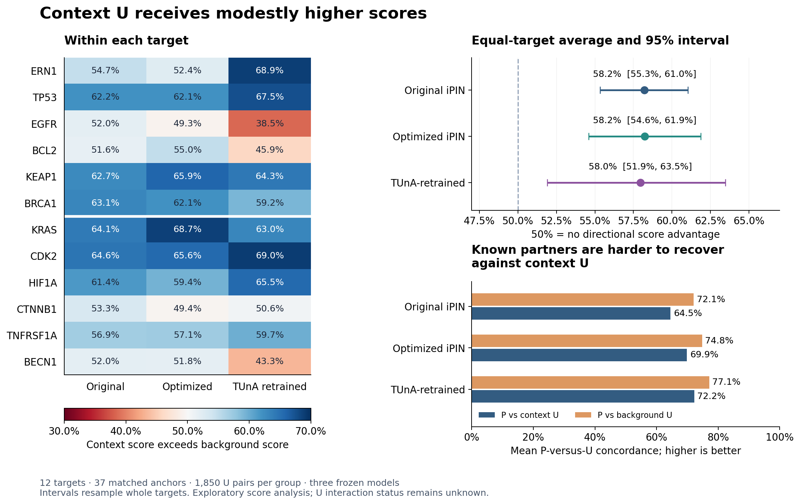

# Do context and background U receive different scores?

**Yes: context U receives modestly higher scores on average in all three models.**
The effect is about a 58% chance that context wins a matched score comparison,
versus 50% for no directional advantage. The distributions substantially overlap,
and individual targets can show the reverse direction. This finding concerns
model scores; actual biological interaction rates in either U group are unknown.

This is a new exploratory analysis of the existing [twelve-target results](../twelve_target_comparison_v1/REPORT.md).
It uses all 1,850 context and 1,850 background pairs. Each of 37 positive anchors
contributes a 50-versus-50 comparison; anchors are averaged within targets and
the 12 targets receive equal weight. Scores are compared only within the same
target, anchor, and model. Ties contribute half a win.

## Main result

| Model | Context wins | 95% target-bootstrap interval | Targets above 50% | Exploratory Holm p |
| --- | --- | --- | --- | --- |
| Original iPIN | 58.2% | 55.3%–61.0% | 12/12 | 0.0015 |
| Optimized iPIN | 58.2% | 54.6%–61.9% | 10/12 | 0.0039 |
| TUnA-retrained | 58.0% | 51.9%–63.5% | 9/12 | 0.0308 |

The interval comes from 100,000 whole-target bootstrap draws. The p-values use
all 4,096 target-effect sign flips and Holm correction for the three models.
All adjusted values are below 0.05 under the stated reference assumptions.
These are exploratory summaries of a deliberately selected panel. Statistical
significance is not a biological effect-size threshold or proof of interaction.
Rank-biserial effects are approximately 0.16 for all three models.

Standalone exports: [PDF](score_comparison.pdf), [SVG](score_comparison.svg).

## Target-specific results

Each value is the anchor-matched fraction of comparisons in which context wins.
Values below 50% favor background. There are no per-target significance claims.

| Target | Original iPIN | Optimized iPIN | TUnA-retrained |
| --- | --- | --- | --- |
| ERN1 | 54.7% | 52.4% | 68.9% |
| TP53 | 62.2% | 62.1% | 67.5% |
| EGFR | 52.0% | 49.3% | 38.5% |
| BCL2 | 51.6% | 55.0% | 45.9% |
| KEAP1 | 62.7% | 65.9% | 64.3% |
| BRCA1 | 63.1% | 62.1% | 59.2% |
| KRAS | 64.1% | 68.7% | 63.0% |
| CDK2 | 64.6% | 65.6% | 69.0% |
| HIF1A | 61.4% | 59.4% | 65.5% |
| CTNNB1 | 53.3% | 49.4% | 50.6% |
| TNFRSF1A | 56.9% | 57.1% | 59.7% |
| BECN1 | 52.0% | 51.8% | 43.3% |

The baseline direction is consistent across all 12 targets. Optimized iPIN has
small reversals for EGFR and CTNNB1. TUnA-retrained has larger reversals for EGFR,
BCL2, and BECN1, so the average does not describe every biological case.

## Consequence for positive-partner retrieval

The preserved parent metrics also show lower P-versus-U concordance against
context candidates. Thus context U is harder, on average, for these models to
rank below the nominated positives. All nominated P, including the parent
report's disclosed TRAIN/development overlaps, remain in this descriptive check.

| Model | P vs context U | P vs background U | Difference (context − background) | Context among top 20 U |
| --- | --- | --- | --- | --- |
| Original iPIN | 0.645 | 0.721 | -7.5 percentage points | 59.6% |
| Optimized iPIN | 0.699 | 0.748 | -4.9 percentage points | 55.8% |
| TUnA-retrained | 0.722 | 0.771 | -4.9 percentage points | 57.9% |

Each target's top 20 U is selected from its combined context/background U list.
The expected context share under group-blind ranking is 50%; exact score ties
receive fractional boundary credit. This check is descriptive.

## Matching and sensitivity

**388/1,850 background candidates (21.0%) happen to meet
their own anchor's context criteria.** Background means unrestricted by those
criteria, rather than known to occupy a different location. Every selected
context candidate passes its recorded context rule.

| Model | Original six | Additional six | Background failing context rule only | Leave-one-target-out range |
| --- | --- | --- | --- | --- |
| Original iPIN | 57.7% | 58.7% | 60.7% | 57.6%–58.8% |
| Optimized iPIN | 57.8% | 58.7% | 60.5% | 57.3%–59.0% |
| TUnA-retrained | 57.4% | 58.5% | 60.4% | 57.0%–59.7% |

Removing these coincidentally matching background candidates strengthens the
directional difference to about 60–61%. This changes the comparison group; it
does not replace the original 50-versus-50 analysis and has no extra p-values.
The direction also survives omitting any one target and is similar in the
original and additional cohorts.

Length matching permits a twofold window, rather than exact length equality.
The equal-target length-comparison probability is 51.7%; individual
anchor groups can still differ in length. [Matching diagnostics](matching_diagnostics.csv)
retain these differences. The analysis cannot isolate a causal effect of cellular
location from length, membrane features, protein-family composition, or other
sequence properties. Context groups were also allocated before background
groups without replacement.

## Interpretation and limits

There is a reproducible, modest score shift in these fixed panels, with
substantial distribution overlap and meaningful target-to-target variation.
The models may respond to properties associated with the matching criteria.
This is not experimental evidence that context U contains more true binders,
or that background U consists of noninteractors.

The 3,700 U rows contain 3,307 unique partner sequences;
367 sequences recur across targets. The panels and anchors were manually
chosen, some targets and partners are related, and the models share training
history. Whole-target resampling avoids pretending every pair is an independent
biological experiment, but it does not eliminate dependence across targets.
Intervals assume exchangeable target sampling; the sign-flip reference assumes
independent, sign-symmetric target effects under the null. These assumptions
are approximate here. No randomized group assignment, causal interpretation,
proteome-wide generalization, or independent three-model replication is claimed.

## Reproducibility

[PROTOCOL.md](PROTOCOL.md) records the analysis choices before this comparison
was computed, after the parent retrieval results were known. The
[run record](ANALYSIS_RUN.json) binds inputs, source, runtime image, versions,
bootstrap seed, and tables. The [independent checks](INDEPENDENT_VALIDATION.json)
validate rank-sum effects, bootstrap intervals with SciPy, top-20 tie credit,
multiple-testing adjustment, and preservation of all 110 parent artifacts.

Statistical implementation references: [Mann-Whitney statistic](https://docs.scipy.org/doc/scipy-1.15.3/reference/generated/scipy.stats.mannwhitneyu.html),
[paired/sign-flip permutation](https://docs.scipy.org/doc/scipy-1.15.3/reference/generated/scipy.stats.permutation_test.html),
and [percentile bootstrap](https://docs.scipy.org/doc/scipy-1.15.3/reference/generated/scipy.stats.bootstrap.html).
