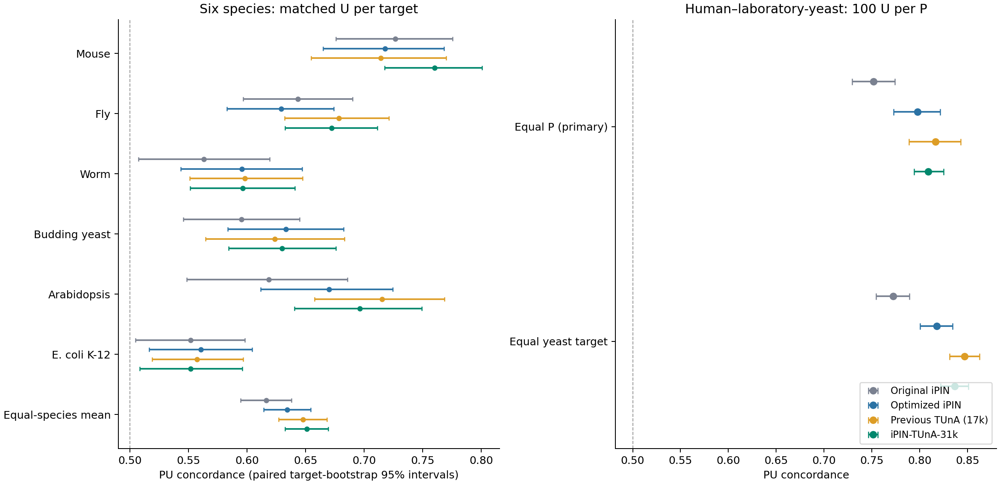

# Default iPIN transfer comparison

Completed 2026-09-26T14:24:31.046802+00:00.

**iPIN-TUnA-31k was applied to every historical pair in both studies: 218,440 pairs in total.** The frozen default is the three-seed, epoch-1 ensemble trained with 31,188 P. All prior models use their archived scores, with exact historical metric and bootstrap reproduction.

Six-species matched-U concordance changed from **0.6478 to 0.6511** against the previous TUnA, a difference of +0.0033 (paired 95% interval [-0.0140, +0.0209]).

Human–laboratory-yeast equal-P concordance changed from **0.8163 to 0.8088**, a difference of -0.0074 (paired 95% interval [-0.0251, +0.0105]).

These are two separate estimands. The six-species result gives equal weight to targets within species and then to species. The reference-organism result gives equal weight to each published P and its assigned 100 U. Their raw metric values should not be compared as a controlled species effect.

## Six-species primary comparison

All 61,385 rows are preserved: 1,385 P and 60,000 U across 300 targets. The table uses the original 100 matched U per target. Background U and combined 200-U results are also supplied.

| Organism | Original iPIN | Optimized iPIN | Previous TUnA (17k) | Default 31k | Difference vs 17k [95% interval] |
|---|---:|---:|---:|---:|---|
| Mouse | 0.7264 | 0.7177 | 0.7141 | 0.7600 | +0.0458 [+0.0052, +0.0923] |
| Fly | 0.6436 | 0.6292 | 0.6783 | 0.6722 | -0.0061 [-0.0371, +0.0263] |
| Worm | 0.5632 | 0.5956 | 0.5983 | 0.5964 | -0.0019 [-0.0460, +0.0381] |
| Budding yeast | 0.5952 | 0.6332 | 0.6237 | 0.6298 | +0.0061 [-0.0481, +0.0600] |
| Arabidopsis | 0.6187 | 0.6701 | 0.7151 | 0.6964 | -0.0187 [-0.0522, +0.0140] |
| E. coli K-12 | 0.5518 | 0.5605 | 0.5574 | 0.5519 | -0.0055 [-0.0535, +0.0426] |
| Equal-species mean | 0.6165 | 0.6344 | 0.6478 | 0.6511 | +0.0033 [-0.0140, +0.0209] |

The default has a higher matched-U concordance point estimate in 2/6 species.

| Equal-species matched-U metric | Original iPIN | Optimized iPIN | Previous TUnA | Default 31k |
|---|---:|---:|---:|---:|
| MAP | 0.1486 | 0.1582 | 0.1664 | 0.1624 |
| MRR | 0.2442 | 0.2755 | 0.2789 | 0.2800 |
| Recall@10 | 0.1896 | 0.2030 | 0.2245 | 0.2243 |
| Known-positive precision@10 | 0.0880 | 0.0937 | 0.1023 | 0.0990 |
| NDCG@10 | 0.1495 | 0.1640 | 0.1756 | 0.1739 |

| Candidate set, equal-species concordance | Original iPIN | Optimized iPIN | Previous TUnA | Default 31k |
|---|---:|---:|---:|---:|
| background | 0.6242 | 0.6430 | 0.6529 | 0.6702 |
| matched | 0.6165 | 0.6344 | 0.6478 | 0.6511 |
| all_U | 0.6203 | 0.6387 | 0.6503 | 0.6607 |

## Human–laboratory-yeast reference panel

All 1,555 published P, all 155,500 globally distinct U, and all 545 yeast targets are retained. Each P has exactly 100 assigned U, with no new filtering in the primary analysis.

| Model | Equal-P concordance [95% interval] | Mean AP | Recall@10 | Equal-target concordance |
|---|---:|---:|---:|---:|
| Original iPIN | 0.7519 [0.7293, 0.7742] | 0.1637 | 0.3698 | 0.7721 |
| Optimized iPIN | 0.7975 [0.7724, 0.8215] | 0.2416 | 0.4887 | 0.8176 |
| Previous TUnA (17k) | 0.8163 [0.7886, 0.8426] | 0.2883 | 0.5363 | 0.8468 |
| iPIN-TUnA-31k | 0.8088 [0.7939, 0.8249] | 0.2264 | 0.4894 | 0.8363 |

Random-order concordance is 0.5; random recall@10 in these 101-pair panels is 10/101 (0.0990).

## Paired differences against each previous model

| Study primary summary | Reference | Default minus reference | Paired 95% interval |
|---|---|---:|---|
| Six species, matched U | Original iPIN | +0.0346 | [+0.0151, +0.0545] |
| Six species, matched U | Optimized iPIN | +0.0167 | [-0.0025, +0.0365] |
| Six species, matched U | Previous TUnA (17k) | +0.0033 | [-0.0140, +0.0209] |
| Human–yeast, equal P | Original iPIN | +0.0570 | [+0.0405, +0.0723] |
| Human–yeast, equal P | Optimized iPIN | +0.0113 | [-0.0057, +0.0280] |
| Human–yeast, equal P | Previous TUnA (17k) | -0.0074 | [-0.0251, +0.0105] |

## Exact training/development exposure

The complete primary panels above stay unchanged. The original exposure sensitivity is reproduced exactly. A new common sensitivity excludes the union of historical and expanded-corpus exact TRAIN/development endpoints from every model. It includes the 31k positives, the U sampling pool, and all six evaluated expanded development partitions. Membership in the U pool is potential sampling exposure. Different cohorts have different denominators.

| Common expanded-exposure sensitivity | Targets | P | U | Previous TUnA | Default 31k | Paired difference [95% interval] |
|---|---:|---:|---:|---:|---:|---|
| Six species, matched U | 297 | 1362 | 29624 | 0.6484 | 0.6508 | +0.0024 [-0.0149, +0.0200] |
| Human–yeast, equal P | 246 | 564 | 17381 | 0.7774 | 0.7640 | -0.0134 [-0.0425, +0.0167] |

| Audit | Study | P rows | U rows |
|---|---|---:|---:|
| historical_exact_TRAIN_DEV_endpoint | nonhuman_transfer_v1 | 23 | 717 |
| any_model_exact_TRAIN_DEV_endpoint | nonhuman_transfer_v1 | 23 | 778 |
| newly_flagged_endpoint_row | nonhuman_transfer_v1 | 0 | 61 |
| historical_exact_TRAIN_DEV_endpoint | reference_organism_pu_transfer_v1 | 924 | 62755 |
| any_model_exact_TRAIN_DEV_endpoint | reference_organism_pu_transfer_v1 | 991 | 112463 |
| newly_flagged_endpoint_row | reference_organism_pu_transfer_v1 | 67 | 49708 |

Exposure audit files contain every exact pair flag and endpoint count. This is an exact-sequence sensitivity, not proof of protein-family independence. Historical homology annotations retained in the score tables refer to the original training corpus; no expanded homology or ESM pretraining audit is claimed.

## Validation and limitations

- Historical pair metadata, sequence snapshots, labels, candidate strata and three archived score columns are unchanged.
- Historical metrics and original 10,000-draw bootstrap intervals were reproduced to tolerance 2e-12.
- All six new member runs passed native-pair agreement (tolerance 1e-5), exact pair-order symmetry, finite-output checks, and unchanged saved model state.
- Independent sorted-rank, sklearn AP, combinatorial rank/MRR and fractional-recall checks passed. The ensemble mean is exact.
- The expanded model changes both its training corpus and selected epoch relative to the old 17k model; this comparison alone does not attribute changes solely to training-set size.
- The intervals are paired target-bootstrap, exploratory and pointwise. Related targets, repeated partners and publication concentration are not fully represented. The human–yeast panel comes from one source publication.
- U is unreported in the archived source, not a verified negative. Retrieval metrics do not identify biological specificity, binding probabilities or prospective assay precision.
- These existing panels have been examined previously. No threshold, checkpoint, species-specific model or calibration was selected from this run.

## Outputs

- [Primary comparison](primary_comparison.csv), [paired differences](primary_paired_differences.csv), [PDF figure](comparison.pdf).
- Each study subfolder contains every member/ensemble prediction, combined historical scores, per-target/per-P metrics, coverage, paired intervals, target wins, exposure audit, and scoring qualification.
- [Metric validation](METRIC_VALIDATION.json), [input freeze](INPUT_FREEZE.json), [prediction freeze](PREDICTION_FREEZE.json).
- [Protocol](PROTOCOL.md), [reproduction instructions](README.md), and final `PRESERVATION.json`.

The two original `benchmark/` directories and all original model/data/results files were treated as read-only. All new artifacts are under `experiments/default_ipin_transfer_comparison_v1/`.
